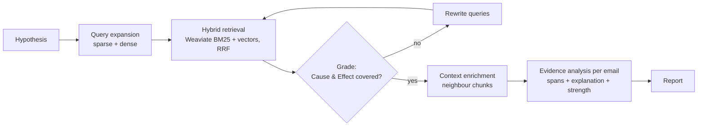
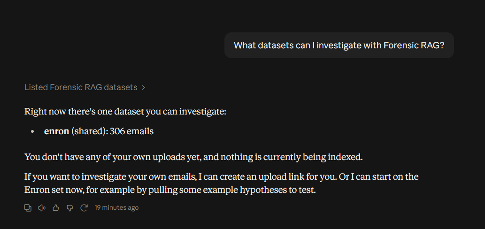
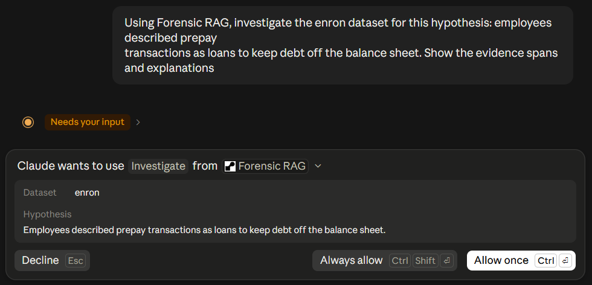
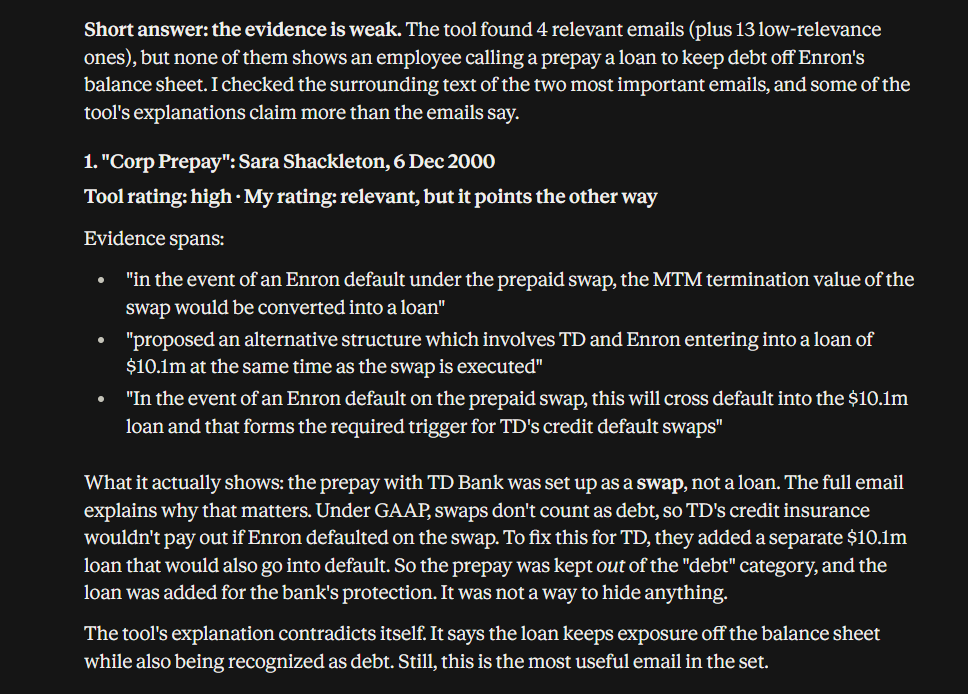
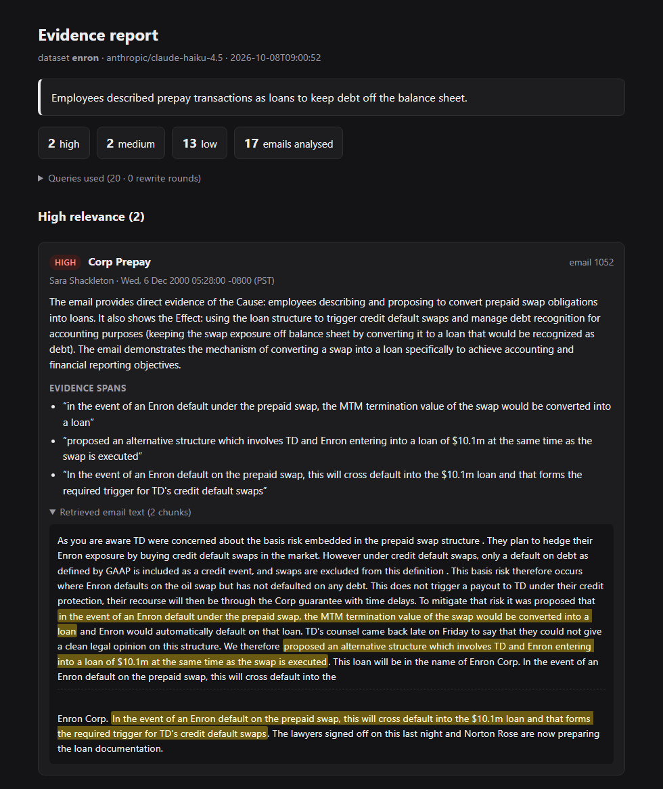
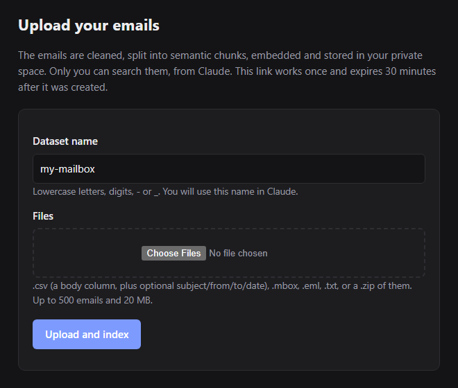

# Forensic Email RAG: an MCP connector for hypothesis-driven investigations

[](https://github.com/aliloloee/forensic-rag-mcp/actions/workflows/tests.yml)
[](LICENSE)


Give it a hypothesis such as *"Employees discussed hiding trading losses from auditors"* and a
set of emails. It returns the emails that support the hypothesis, with **verbatim evidence spans**
and an **explanation** for each. It runs as an **MCP server**, so Claude can use it as a connector.
Users can also upload their own mailboxes.

This is a simplified, deployable version of my master's thesis pipeline
([*Hypothesis-Driven Forensic Email Analysis with Retrieval-Augmented Generation*](https://amslaurea.unibo.it/id/eprint/39544/1/Hypothesis-Driven%20Forensic%20Email%20Analysis%20with%20Retrieval-Augmented%20Generation.pdf),
University of Bologna). The original research pipeline is in [aliloloee/forensic-analysis](https://github.com/aliloloee/forensic-analysis).



## What it does

| Step | How |
|---|---|
| Ingestion | Emails are cleaned, split with LangChain `SemanticChunker`, embedded with Voyage AI `voyage-3.5`, and stored in Weaviate |
| Query expansion | An LLM turns the hypothesis into keyword queries (BM25) and sentence queries (semantic), using the thesis prompts |
| Retrieval | Weaviate native hybrid search per query, fused across queries with Reciprocal Rank Fusion |
| Agentic loop | LangGraph grades whether the hits cover the hypothesis's *Cause* and *Effect*, and writes new queries for what is missing |
| Enrichment | Hit chunks plus their neighbouring chunks, in document order |
| Inference | Claude (through OpenRouter) labels each email high / medium / low and quotes the evidence verbatim |
| Output | An HTML evidence report with spans highlighted in the email text. Spans that are not verbatim are flagged |

**MCP, both sides:**
- The pipeline is an MCP server: tools, resources and a prompt, available over stdio or Streamable HTTP.
- The LangGraph agent is an MCP client of that server, through `langchain-mcp-adapters`.

## Two ways to run it

| | Local | Hosted connector |
|---|---|---|
| Transport | stdio | Streamable HTTP at `https://<host>/mcp` |
| Users | just you (no login) | OAuth 2.1 through WorkOS AuthKit; each user gets a private Weaviate tenant |
| Data | `ingest` CLI | upload page (signed single-use link from the `create_upload_link` tool) |
| Clients | the LangGraph agent, Claude Code, Claude Desktop | claude.ai, Claude Desktop, Claude Code |

---

## How to use

There is no public instance: you connect Claude to **your own deployment** (see
[Deploying the hosted connector](#deploying-the-hosted-connector)). In claude.ai, open **Settings →
Connectors → Add custom connector**, give it a name such as `Forensic RAG`, and enter
`https://<your-service>/mcp`. Claude then opens a sign-in page. To use it locally without hosting,
see [Local quick start](#local-quick-start).

After that, you just talk to Claude. It picks the right tools itself. The screenshots below are from
claude.ai, with the connector named `Forensic RAG`.

### 1. See what you can investigate

> *"What datasets can I investigate with Forensic RAG?"*

Claude calls `list_datasets`. You always see the shared **`enron`** dataset (306 emails), plus any
datasets you have uploaded. To try the thesis hypotheses, ask *"Show me the example hypotheses."*:
**H1** is about prepay transactions disguised as loans, **H2** about destroying documents before an
audit, and **H3** about manipulating energy schedules and prices.



### 2. Run an investigation

> *"Using Forensic RAG, investigate the enron dataset for this hypothesis: employees described prepay
> transactions as loans to keep debt off the balance sheet. Show the evidence spans and explanations."*

The hypothesis can be any free-text claim of possible misconduct, or just `H1`, `H2` or `H3`.

**Write it as a Cause and an Effect.** The pipeline is built around hypotheses with two parts:
an action (the **Cause**) and its purpose or outcome (the **Effect**). It splits the hypothesis into
these two parts, and an email's rating depends on which parts it shows. A hypothesis in this form
gives the clearest results:

| | Hypothesis |
|---|---|
| ✅ Cause + Effect | *Traders **withheld power from the grid** **to push up market prices**.* |
| ✅ Cause + Effect | *Staff **deleted audit-related emails** **before the SEC investigation**.* |
| ⚠️ Topic only | *Emails about the California energy market.* |
| ⚠️ Effect only | *The company's reported debt was too low.* |

The weaker forms still work, but the ratings are less meaningful. "High" means both parts are
present, which a hypothesis without both parts can't really define.

Claude picks the `investigate` tool and fills in its arguments. Unless you have chosen
*Always allow* for the tool, it asks for your approval first:



The run takes one to three minutes. The tool rates every email it analysed:

| Strength | Meaning |
|---|---|
| **high** | the email shows both the action (Cause) and its purpose or outcome (Effect) |
| **medium** | the email shows only one of the two, e.g. a prepay described as "financing" |
| **low** | weak or no evidence. Not listed in the chat, but kept in the report |

Every email comes with the **evidence spans quoted verbatim** and an explanation of how they relate
to the hypothesis.

Claude does not just repeat these ratings. It can fetch the surrounding text of any email
(`get_email_context`), so it checks the tool's explanations against the emails and says where it
disagrees. In this run, it rated one email "off-topic for balance sheets", and it pointed out that
the "Corp Prepay" email shows a prepay kept *out* of the debt category, the opposite of what the
hypothesis claims:



### 3. Open the evidence report

Each answer ends with a **report link**. The HTML page lists every analysed email, including
the low ones. The evidence spans are highlighted inside the retrieved email text, and a span that
does not appear verbatim is flagged. The link works without a second sign-in and is valid for 7 days.



### 4. Investigate your own emails

> *"Give me an upload link for my emails."*

Claude returns a private link. It works once and expires after 30 minutes. On that page,
name the dataset, choose your files (`.mbox`, `.eml`, `.csv`, `.txt`, or a `.zip` of them; up to 500
emails and 20 MB), and click **Upload and index**. The page shows the indexing progress. Wait until it
says it is done.



Then investigate it like the Enron data:

> *"Investigate my dataset 'my-mailbox': did anyone discuss backdating contracts?"*

Your datasets are visible only to you. To remove one, ask *"Delete my dataset 'my-mailbox'."*

### 5. Go step by step (optional)

For more control, ask Claude to run the stages itself instead of the one-shot `investigate`:

> *"Expand this hypothesis into search queries, search the enron dataset with them, and analyse the
> five most promising emails one by one."*

Claude then uses `expand_queries`, `search_chunks`, `get_email_context` and `analyze_email`. You can
steer it between steps, e.g. *"Search again, but focus on the auditors."*

### Good to know

- **The first request can take about a minute** while the free server wakes up.
- **Limits per user:** 1 investigation at a time and 10 per day, and 100 step-by-step analysis calls
  per hour. When you hit one, Claude tells you when to try again.
- **Results are evidence to review, not a verdict.** Always read the quoted spans in context. The
  report shows the surrounding text for exactly this reason.

---

## Local quick start

```powershell
cd forensic-rag-mcp
python -m venv .venv
.venv\Scripts\activate
pip install -e .
copy .env.example .env        # fill OPENROUTER_API_KEY and VOYAGE_API_KEY
docker compose up -d          # Weaviate on :8080 / :50051

python -m forensic_rag.ingest --reset        # bundled 306 Enron emails -> shared dataset "enron"
python -m forensic_rag.agent --hypothesis "Employees discussed lobbying regulators on energy market rules." --open
```

Each run writes `results/<dataset>_<H1|H2|H3|custom>_<timestamp>.json` and an `.html` evidence
report. `--open` opens the report.

Other commands:
```powershell
python -m forensic_rag.agent --hypothesis H3                 # a thesis hypothesis -> can be evaluated
python -m forensic_rag.evaluate results\*.json               # P/R/F1 vs ground truth (H1-H3 only)
python -m forensic_rag.report results\*.json                 # re-render HTML reports
python -m forensic_rag.agent --chat "Which emails discuss destroying documents before an audit?"
python -m forensic_rag.ingest --source H3 --dataset enron-h3 # one thesis topic as its own dataset
```

Use the server from Claude Code locally:
```powershell
claude mcp add forensic-rag -- <path-to>orensic-rag-mcp\.venv\Scripts\python.exe -m forensic_rag.mcp_server
```
Or try it in the MCP Inspector: `mcp dev src/forensic_rag/mcp_server.py`.

---

## Deploying the hosted connector

You need accounts with OpenRouter, Voyage AI, Weaviate Cloud, WorkOS and Render. Each has a free tier that is enough for a demo.

### 1. Weaviate Cloud
1. Create a cluster. The free sandbox expires after 14 days and allows one collection, which is all
   this project uses.
2. Copy its **REST endpoint** and an **admin API key**.
3. Load the shared Enron data into the cluster. The Docker image contains only the code, so you
   run the ingestion from your machine against the cluster.
   - Put `WEAVIATE_URL` and `WEAVIATE_API_KEY` in your **local** `.env`. When `WEAVIATE_URL` is set, it
     takes precedence over the local Docker settings.
   - Run `python -m forensic_rag.ingest` on your machine. It writes the 306 emails into the cluster's
     shared `public` tenant.
   - Clear `WEAVIATE_URL` afterwards to go back to local Docker.
   - Don't use `--reset` against the cloud cluster: it deletes every tenant, including users' uploads.
     Re-running without it only replaces the `enron` dataset.

### 2. Render
1. Fork or push this repository to GitHub.
2. In Render, choose **New → Blueprint** and pick the repository.
3. Fill in the secret environment variables. Set `PUBLIC_URL` to the service URL, e.g.
   `https://<your-service>.onrender.com`.
4. Check that `https://<service>/health` returns `{"status": "ok"}`.

### 3. WorkOS AuthKit
1. Create a WorkOS project and enable **AuthKit**.
2. Under **Connect → Configuration**:
   - Enable **Client ID Metadata Document** and **Dynamic Client Registration**.
   - Add the resource indicator `https://<service>/mcp`.
3. Copy your AuthKit domain (e.g. `your-app.authkit.app`) into Render's `AUTHKIT_DOMAIN`.
4. Redeploy.

From then on, an unauthenticated request to `/mcp` gets a `401` that points to
`/.well-known/oauth-protected-resource/mcp`. Claude discovers AuthKit from there and runs the
sign-in itself.

### 4. Connect from Claude
- **claude.ai / Claude Desktop:** Settings → Connectors → *Add custom connector* →
  `https://<service>/mcp`, then sign in.
- **Claude Code:** `claude mcp add --transport http forensic-rag https://<service>/mcp`, then
  run `/mcp` to sign in.

Then follow [How to use](#how-to-use).

---

## MCP interface

**Tools** (the dataset defaults to `enron`):

| Tool | Purpose |
|---|---|
| `list_datasets` | your datasets, the shared ones, and uploads still indexing |
| `create_upload_link` | signed, single-use link to the upload page (.csv, .mbox, .eml, .txt, .zip) |
| `delete_dataset` | permanently delete one of your datasets |
| `list_example_hypotheses` | the three annotated thesis hypotheses H1–H3 |
| `expand_queries` | sparse + dense queries for a hypothesis |
| `search_chunks` | hybrid search in a dataset (`alpha`: 0 = BM25, 1 = vectors) |
| `get_email_context`, `get_email` | hit chunks with neighbours, or the full email |
| `analyze_email` | Cause/Effect evidence analysis of one email |
| `investigate` | the full pipeline in one call. Streams progress notifications and returns the high/medium emails plus a `report_url` |

**Resources:** `hypothesis://{id}`, `prompt://inference`.
**Prompt:** `forensic_investigation(hypothesis, dataset)`.

## Security model

- **Identity.** It comes only from the verified OAuth token: an RS256 JWT checked against AuthKit's
  JWKS, issuer, audience = this server's `/mcp` URL, and expiry. No tool accepts a user ID.
- **Isolation.** Every Weaviate read and write goes through exactly one tenant. Users get their own
  tenant (`u_<subject>`), and the Enron data is in a shared read-only `public` tenant. Other users'
  datasets are invisible: a search on another user's dataset name fails with "Unknown dataset".
- **Upload and report links.** These are HMAC-signed and expire after 30 minutes and 7 days
  respectively. Upload links are single-use, and both kinds of link are bound to the user's tenant.
- **Cost limits.** At most 500 emails and 20 MB per upload, and 5 datasets per user. On the tools
  that spend LLM credit, each user may run one `investigate` at a time and 10 per 24 hours, and
  call `analyze_email` and `expand_queries` 100 times per hour. A user who exceeds a limit gets an
  error that says when to try again. All of these are configurable through env vars; the rate limits
  are kept in memory and reset when the server restarts.
- **Caveats** (demo-grade, which is the intended scope):
  - Uploaded emails are sent to Voyage AI for embedding and to the LLM provider for analysis.
  - Hosted reports and job status live on the instance's disk and in memory, so they are lost when it restarts.

## Tests

```powershell
pip install -e ".[dev]"
pytest
```

The suite needs no API keys and makes no network calls. Weaviate, Voyage, OpenRouter and the WorkOS
signature check are faked. It runs on every push via GitHub Actions. It covers:
- **The hosted server, over real HTTP and MCP.** Without a valid token you get a `401`, with discovery
  metadata pointing to AuthKit. Two users, alice and bob, check that one user's datasets are invisible
  to the other: listing, searching, reading, deleting and investigating all fail. Upload links are
  single-use, and forged upload or report links are rejected. Rate limits are per user, and a
  mistyped dataset name does not use up the quota.
- **Signed links and tenant names:** tampering, expiry, and characters Weaviate does not allow.
- **Upload parsing:** CSV header aliases, `.eml`, mixed `.zip`, and rejected inputs.
- **Retrieval arithmetic:** 10 chunks per query, RRF deduplication without truncation, and every hit
  is enriched.

Answer quality is measured separately against the thesis ground truth with `python -m forensic_rag.evaluate`.

## Data

`data/enron_emails.jsonl` holds the 306 emails used in the thesis: emails from the public
[Enron corpus](https://www.cs.cmu.edu/~enron/) (EDRM v2), selected through the TREC 2010 Legal Track
topics 201/204/205 (H1/H2/H3). They were already cleaned by the thesis pipeline. Each record has
`email_id, topic, subject, sender, recipients, date, docID, body`. The H1–H3 annotations in
`hypotheses.py` are the thesis's manual annotations, used for evaluation.

## Layout

```
data/                 enron_emails.jsonl (the bundled Enron sample)
prompts/              expansion_sparse.txt, expansion_dense.txt, inference.txt (the thesis prompts)
src/forensic_rag/
  config.py           .env settings, pipeline defaults, limits
  models.py           Claude via OpenRouter, Voyage embeddings
  store.py            Weaviate: one multi-tenant collection (emails + chunks), hybrid search, neighbour lookup
  parsers.py          upload parsing (.csv/.mbox/.eml/.txt/.zip) + email cleaning
  ingest.py           emails -> semantic chunks -> embeddings -> Weaviate
  rag.py              expand, retrieve (RRF), enrich, analyze, investigate, build_report
  auth.py             AuthKit token verification, current tenant, signed links
  limits.py           per-user rate limits on the LLM-spending tools
  web.py              upload page, upload status, hosted report pages
  mcp_server.py       FastMCP server (stdio or Streamable HTTP + OAuth)
  agent.py            LangGraph agentic RAG as an MCP client
  report.py           HTML evidence report
  evaluate.py         P/R/F1 against the thesis ground truth
  hypotheses.py       thesis hypotheses H1-H3 + annotations
tests/                pytest suite (all external services faked)
.github/workflows/    CI: pytest on every push
Dockerfile, render.yaml, docker-compose.yml (local Weaviate)
```

## Notes

- **The hypothesis format is set by the prompts, not by the code.** The Cause/Effect structure from
  the thesis lives in three prompts. In [`prompts/inference.txt`](prompts/inference.txt) it splits the
  hypothesis and defines high, medium and low. In `GRADE_PROMPT` in `agent.py`, the LangGraph loop uses
  it to check that the hits cover both parts. The `forensic_investigation` MCP prompt uses it too. The
  query-expansion prompts do not depend on it. To support another format, for example a timeline
  ("X happened before Y") or a list of required elements, rewrite those prompts. The output schema of
  spans, reason and strength stays the same, so no other code has to change.

- The default `LLM_MODEL` is `anthropic/claude-haiku-4.5`. It is cheap, and on H1 it followed the
  Cause/Effect rubric better than Sonnet 5.5, which rated "Cause only" emails low instead of medium.

## License

The code is available under the [MIT License](LICENSE). The emails in `data/` are a sample of
the public Enron corpus. They are not covered by this license and remain subject to the corpus's
own terms.
