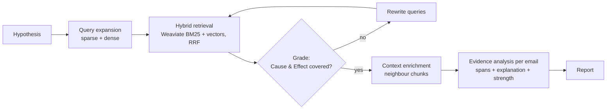

# Forensic Email RAG: an MCP connector for hypothesis-driven investigations

[](https://github.com/aliloloee/forensic-rag-mcp/actions/workflows/tests.yml)

Give it a hypothesis such as *"Employees discussed hiding trading losses from auditors"* and a
set of emails. It returns the emails that support the hypothesis, with **verbatim evidence spans**
and an **explanation** for each. It runs as an **MCP server**, so Claude can use it as a connector.
Users can also upload their own mailboxes.

This is a simplified, deployable version of my master's thesis pipeline
(*Hypothesis-Driven Forensic Email Analysis with Retrieval-Augmented Generation*, University of
Bologna). The original research pipeline is in [aliloloee/forensic-analysis](https://github.com/aliloloee/forensic-analysis).



## What it does

| Step | How |
|---|---|
| Ingestion | Emails are cleaned, split with LangChain `SemanticChunker`, embedded with Voyage AI `voyage-3.5`, and stored in Weaviate |
| Query expansion | An LLM turns the hypothesis into keyword queries (BM25) and sentence queries (semantic), using the thesis prompts |
| Retrieval | Weaviate native hybrid search per query, fused across queries with Reciprocal Rank Fusion |
| Agentic loop | LangGraph grades whether the hits cover the hypothesis's *Cause* and *Effect*, and writes new queries for what is missing |
| Enrichment | Hit chunks plus their neighbouring chunks, in document order |
| Inference | Claude (through OpenRouter) labels each email high / medium / low and quotes the evidence verbatim |
| Output | An HTML evidence report with spans highlighted in the email text. Spans that are not verbatim are flagged |

**MCP, both sides:**
- The pipeline is an MCP server: tools, resources and a prompt, available over stdio or Streamable HTTP.
- The LangGraph agent is an MCP client of that server, through `langchain-mcp-adapters`.

## Two ways to run it

| | Local | Hosted connector |
|---|---|---|
| Transport | stdio | Streamable HTTP at `https://<host>/mcp` |
| Users | just you (no login) | OAuth 2.1 through WorkOS AuthKit; each user gets a private Weaviate tenant |
| Data | `ingest` CLI | upload page (signed single-use link from the `create_upload_link` tool) |
| Clients | the LangGraph agent, Claude Code, Claude Desktop | claude.ai, Claude Desktop, Claude Code |

---

## Local quick start

```powershell
cd forensic-rag-mcp
python -m venv .venv
.venv\Scripts\activate
pip install -e .
copy .env.example .env        # fill OPENROUTER_API_KEY and VOYAGE_API_KEY
docker compose up -d          # Weaviate on :8080 / :50051

python -m forensic_rag.ingest --reset        # bundled 306 Enron emails -> shared dataset "enron"
python -m forensic_rag.agent --hypothesis "Employees discussed lobbying regulators on energy market rules." --open
```

Each run writes `results/<dataset>_<H1|H2|H3|custom>_<timestamp>.json` and an `.html` evidence
report. `--open` opens the report.

Other commands:
```powershell
python -m forensic_rag.agent --hypothesis H3                 # a thesis hypothesis -> can be evaluated
python -m forensic_rag.evaluate results\*.json               # P/R/F1 vs ground truth (H1-H3 only)
python -m forensic_rag.report results\*.json                 # re-render HTML reports
python -m forensic_rag.agent --chat "Which emails discuss destroying documents before an audit?"
python -m forensic_rag.ingest --source H3 --dataset enron-h3 # one thesis topic as its own dataset
```

Use the server from Claude Code locally:
```powershell
claude mcp add forensic-rag -- <path-to>orensic-rag-mcp\.venv\Scripts\python.exe -m forensic_rag.mcp_server
```
Or try it in the MCP Inspector: `mcp dev src/forensic_rag/mcp_server.py`.

---

## Deploying the hosted connector

You need accounts with OpenRouter, Voyage AI, Weaviate Cloud, WorkOS and Render. Each has a free tier that is enough for a demo.

### 1. Weaviate Cloud
1. Create a cluster. The free sandbox expires after 14 days and allows one collection, which is all
   this project uses.
2. Copy its **REST endpoint** and an **admin API key**.
3. Load the shared Enron data into the cluster. The Docker image contains only the code, so you
   run the ingestion from your machine against the cluster.
   - Put `WEAVIATE_URL` and `WEAVIATE_API_KEY` in your **local** `.env`. When `WEAVIATE_URL` is set, it
     takes precedence over the local Docker settings.
   - Run `python -m forensic_rag.ingest` on your machine. It writes the 306 emails into the cluster's
     shared `public` tenant.
   - Clear `WEAVIATE_URL` afterwards to go back to local Docker.
   - Don't use `--reset` against the cloud cluster: it deletes every tenant, including users' uploads.
     Re-running without it only replaces the `enron` dataset.

### 2. Render
1. Fork or push this repository to GitHub.
2. In Render, choose **New → Blueprint** and pick the repository.
3. Fill in the secret environment variables. Set `PUBLIC_URL` to the service URL, e.g.
   `https://forensic-rag.onrender.com`.
4. Check that `https://<service>/health` returns `{"status": "ok"}`.

### 3. WorkOS AuthKit
1. Create a WorkOS project and enable **AuthKit**.
2. Under **Connect → Configuration**:
   - Enable **Client ID Metadata Document** and **Dynamic Client Registration**.
   - Add the resource indicator `https://<service>/mcp`.
3. Copy your AuthKit domain (e.g. `your-app.authkit.app`) into Render's `AUTHKIT_DOMAIN`.
4. Redeploy.

From then on, an unauthenticated request to `/mcp` gets a `401` that points to
`/.well-known/oauth-protected-resource/mcp`. Claude discovers AuthKit from there and runs the
sign-in itself.

### 4. Connect from Claude
- **claude.ai / Claude Desktop:** Settings → Connectors → *Add custom connector* →
  `https://<service>/mcp`, then sign in.
- **Claude Code:** `claude mcp add --transport http forensic-rag https://<service>/mcp`, then
  run `/mcp` to sign in.

Then ask, for example:
> *"Give me an upload link for my emails."* (open it, upload a `.mbox` or `.zip`, wait for indexing)
> *"Investigate in my dataset 'my-mailbox' whether anyone discussed backdating contracts. Show the evidence spans and explanations."*

---

## MCP interface

**Tools** (the dataset defaults to `enron`):

| Tool | Purpose |
|---|---|
| `list_datasets` | your datasets, the shared ones, and uploads still indexing |
| `create_upload_link` | signed, single-use link to the upload page (.csv, .mbox, .eml, .txt, .zip) |
| `delete_dataset` | permanently delete one of your datasets |
| `list_example_hypotheses` | the three annotated thesis hypotheses H1–H3 |
| `expand_queries` | sparse + dense queries for a hypothesis |
| `search_chunks` | hybrid search in a dataset (`alpha`: 0 = BM25, 1 = vectors) |
| `get_email_context`, `get_email` | hit chunks with neighbours, or the full email |
| `analyze_email` | Cause/Effect evidence analysis of one email |
| `investigate` | the full pipeline in one call. Streams progress notifications and returns the high/medium emails plus a `report_url` |

**Resources:** `hypothesis://{id}`, `prompt://inference`.
**Prompt:** `forensic_investigation(hypothesis, dataset)`.

## Security model

- **Identity.** It comes only from the verified OAuth token: an RS256 JWT checked against AuthKit's
  JWKS, issuer, audience = this server's `/mcp` URL, and expiry. No tool accepts a user ID.
- **Isolation.** Every Weaviate read and write goes through exactly one tenant. Users get their own
  tenant (`u_<subject>`), and the Enron data is in a shared read-only `public` tenant. Other users'
  datasets are invisible: a search on another user's dataset name fails with "Unknown dataset".
- **Upload and report links.** These are HMAC-signed and expire after 30 minutes and 7 days
  respectively. Upload links are single-use, and both kinds of link are bound to the user's tenant.
- **Cost limits.** At most 500 emails and 20 MB per upload, and 5 datasets per user. All are
  configurable.
- **Caveats** (demo-grade, which is the intended scope):
  - Uploaded emails are sent to Voyage AI for embedding and to the LLM provider for analysis.
  - Hosted reports and job status live on the instance's disk and in memory, so they are lost when it restarts.

## Tests

```powershell
pip install -e ".[dev]"
pytest
```

The suite needs no API keys and makes no network calls. Weaviate, Voyage, OpenRouter and the WorkOS
signature check are faked. It runs on every push via GitHub Actions. It covers:
- **The hosted server, over real HTTP and MCP.** Without a valid token you get a `401`, with discovery
  metadata pointing to AuthKit. Two users, alice and bob, check that one user's datasets are invisible
  to the other: listing, searching, reading, deleting and investigating all fail. Upload links are
  single-use, and forged upload or report links are rejected.
- **Signed links and tenant names:** tampering, expiry, and characters Weaviate does not allow.
- **Upload parsing:** CSV header aliases, `.eml`, mixed `.zip`, and rejected inputs.
- **Retrieval arithmetic:** 10 chunks per query, RRF deduplication without truncation, and every hit
  is enriched.

Answer quality is measured separately against the thesis ground truth with `python -m forensic_rag.evaluate`.

## Results on the thesis data

`H3` (energy schedules and market prices), whole 105-email topic, one run:

| | Precision | Recall | F1 |
|---|---|---|---|
| Retrieval (emails reaching inference) | 0.47 | 0.70 | 0.56 |
| Evidence labelled high or medium vs annotated relevant | 0.93 | 0.70 | 0.80 |

## Data

`data/enron_emails.jsonl` holds the 306 emails used in the thesis: emails from the public
[Enron corpus](https://www.cs.cmu.edu/~enron/) (EDRM v2), selected through the TREC 2010 Legal Track
topics 201/204/205 (H1/H2/H3). They were already cleaned by the thesis pipeline. Each record has
`email_id, topic, subject, sender, recipients, date, docID, body`. The H1–H3 annotations in
`hypotheses.py` are the thesis's manual annotations, used for evaluation.

## Layout

```
data/                 enron_emails.jsonl (the bundled Enron sample)
prompts/              expansion_sparse.txt, expansion_dense.txt, inference.txt (the thesis prompts)
src/forensic_rag/
  config.py           .env settings, pipeline defaults, limits
  models.py           Claude via OpenRouter, Voyage embeddings
  store.py            Weaviate: one multi-tenant collection (emails + chunks), hybrid search, neighbour lookup
  parsers.py          upload parsing (.csv/.mbox/.eml/.txt/.zip) + email cleaning
  ingest.py           emails -> semantic chunks -> embeddings -> Weaviate
  rag.py              expand, retrieve (RRF), enrich, analyze, investigate, build_report
  auth.py             AuthKit token verification, current tenant, signed links
  web.py              upload page, upload status, hosted report pages
  mcp_server.py       FastMCP server (stdio or Streamable HTTP + OAuth)
  agent.py            LangGraph agentic RAG as an MCP client
  report.py           HTML evidence report
  evaluate.py         P/R/F1 against the thesis ground truth
  hypotheses.py       thesis hypotheses H1-H3 + annotations
tests/                pytest suite (all external services faked)
.github/workflows/    CI: pytest on every push
Dockerfile, render.yaml, docker-compose.yml (local Weaviate)
```

## Notes

- The default `LLM_MODEL` is `anthropic/claude-haiku-4.5`. It is cheap, and on H1 it followed the
  Cause/Effect rubric better than Sonnet 5.5, which rated "Cause only" emails low instead of medium.
